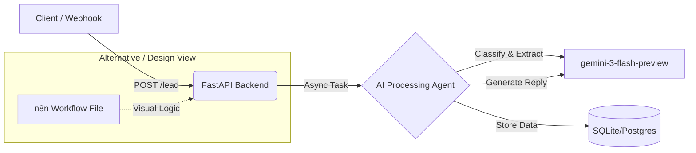

# AI Agent Workflow Automation (Assessment 1)

## Overview

A production-ready lead processing system designed to classify, extract, and respond to incoming business inquiries. This solution implements a **code-first architecture** using FastAPI and Python for maximum control, type safety, and testability, while providing an n8n workflow definition as a visual design reference.

## Architecture

The system follows an event-driven pattern where the Python backend acts as the central orchestration engine.



## Workflow Orchestration Strategy

### Why Code-First (Python/FastAPI)?

While n8n is excellent for visual automation, I chose a **Python-based orchestration approach** for this specific implementation to demonstrate:

1. **Type Safety:** Using Pydantic models to strictly validate incoming payloads and LLM outputs, preventing "silent failures" common in loosely typed visual workflows.
2. **Granular Error Handling:** Custom retry logic with exponential backoff and specific exception catching (e.g., distinguishing between API timeouts vs. bad requests).
3. **Unit Testing:** The ability to write `pytest` suites to verify logic in isolation, which is critical for production systems handling business data.

### The n8n Workflow

An equivalent n8n workflow definition is included in `n8n-workflows/lead-processing.json`.

* **Status:** Prototype / Visual Reference.
* **Purpose:** Demonstrates how the logic maps to a visual node-based structure (Webhook -> AI Agent -> Database -> Response).
* **Usage:** Can be imported into n8n to visualize the decision tree implemented in the Python backend.

## Quick Start

### 1. Backend Setup

```bash
cd backend
python -m venv venv
source venv/bin/activate  # Windows: venv\Scripts\activate
pip install -r requirements.txt

```

### 2. Configuration

Create a `.env` file in the `backend/` directory:

```ini
LLM_PROVIDER=gemini
LLM_API_KEY=your_google_api_key_here
LLM_MODEL=gemini-1.5-flash
DATABASE_URL=sqlite:///./leads.db

```

### 3. Run Application

```bash
uvicorn main:app --reload

```

## System Capabilities

### 1. Intelligent Classification

The system uses **gemini-3-flash-preview** to categorize incoming messages into three distinct intents:

* **Sales:** Inquiries about pricing, enterprise plans, or product features.
* **Support:** Technical issues, bug reports, or help requests.
* **Spam:** Unsolicited marketing or irrelevant content.

### 2. Entity Extraction

Regardless of the message format, the AI extracts structured data:

* `name`: The sender's name (if available).
* `company`: Organization name.
* `requirement`: A concise summary of their specific need.

### 3. Automated Response

Generates a context-aware response based on the intent:

* *Sales* -> Encourages a demo or call.
* *Support* -> Assures ticket creation and rapid response.
* *Spam* -> Politely declines or ignores.

## Design Decisions & Prompt Engineering

### Prompt Strategy

I utilized a **Two-Stage Prompting** strategy to ensure accuracy:

1. **Stage 1 (Classification):** A strict JSON-output prompt that forces the LLM to categorize and extract data without "chatting."
* *Technique:* Few-shot structure implied via schema definition.


2. **Stage 2 (Response):** A separate generation prompt that takes the *structured data* from Stage 1 to generate the final human-readable reply.
* *Benefit:* Prevents the AI from hallucinating details in the reply that contradict the extracted data.


### Hallucination Reduction

* **Strict JSON Mode:** The LLM is forced to output valid JSON, reducing free-form rambling.
* **Confidence Thresholds:** If the classification confidence score is below **0.6**, the system defaults to an "Unclear" intent rather than guessing.
* **Data Validation:** Pydantic validators ensure that extracted fields meet minimum length and format requirements before being saved.

### Error Handling

* **Exponential Backoff:** If the LLM API fails (e.g., 503 Service Unavailable), the system retries 3 times with increasing delays (2s, 4s, 8s).
* **Graceful Degradation:** If AI processing completely fails, the system saves the lead as "Received" and returns a generic fallback message, ensuring no data is lost.

## API Reference

| Endpoint | Method | Description |
| --- | --- | --- |
| `/webhook/lead` | `POST` | Primary entry point. Accepts `{message: str}`. Returns `lead_id`. |
| `/leads/{id}` | `GET` | Retrieve processing status, classification result, and AI response. |
| `/health` | `GET` | System health check. |

## Testing

Run the automated test suite to verify the pipeline:

```bash
pytest
```