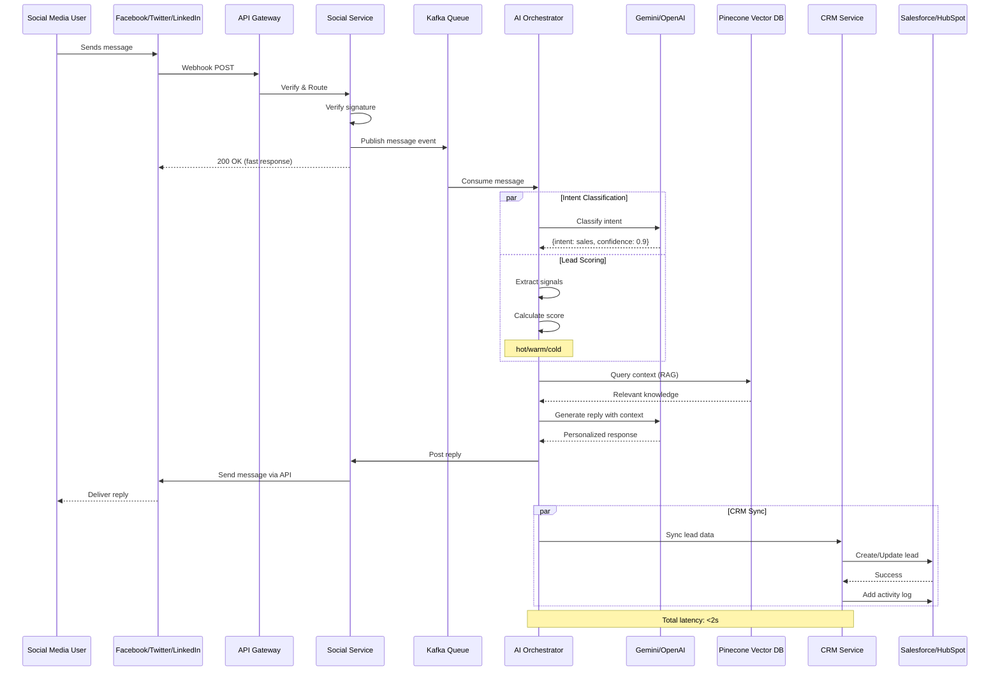
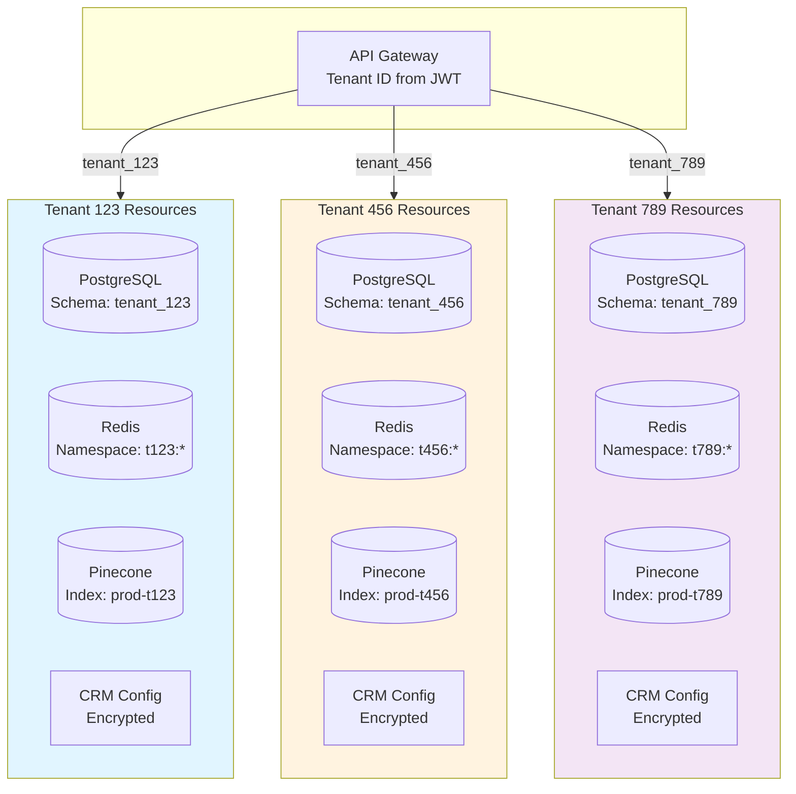
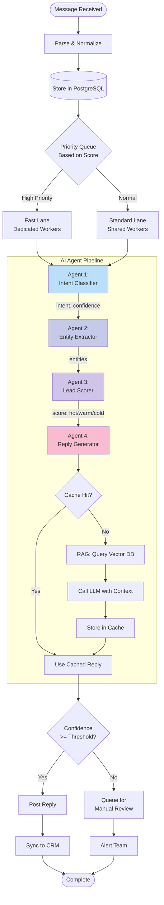
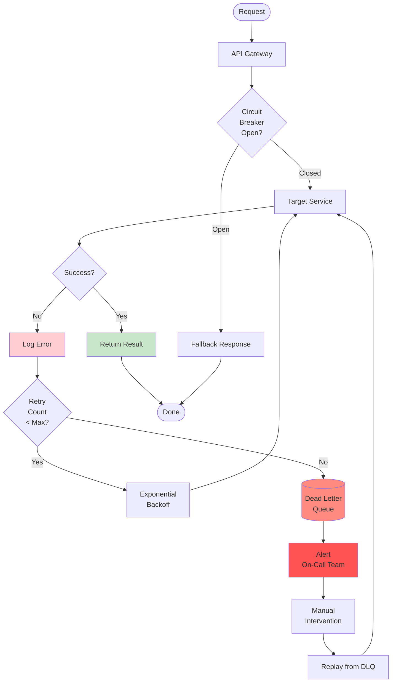
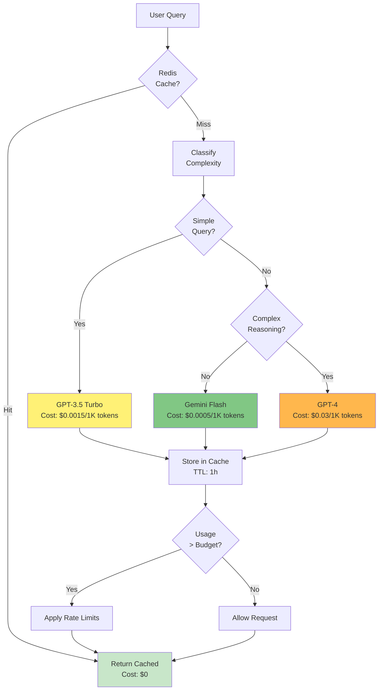
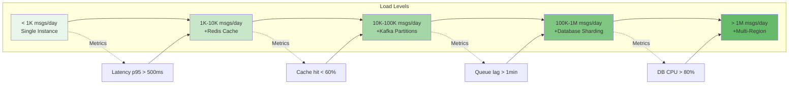
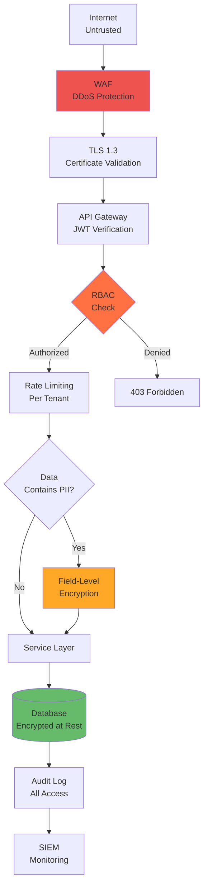

# System Architecture Diagrams

## 1. Message Flow Sequence

## 2. Tenant Isolation Architecture

## 3. AI Agent Pipeline Detailed

## 4. Failure Handling & Recovery

## 5. Cost Optimization Flow

## 6. Scaling Strategy

## 7. Security Layers

