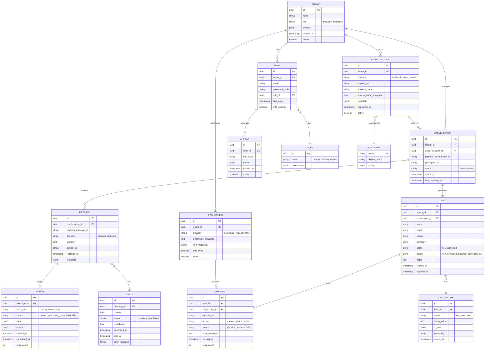

# Database Schema Documentation

## Entity Relationship Diagram



## Table Schemas (PostgreSQL)

### Multi-Tenant Setup

```sql
-- Database per tenant NOT used - using schema per tenant instead
CREATE SCHEMA tenant_123;
CREATE SCHEMA tenant_456;

-- Set search path per connection
SET search_path TO tenant_123, public;
```

### Core Tables

```sql
-- Tenants table (shared, in public schema)
CREATE TABLE public.tenants (
    id UUID PRIMARY KEY DEFAULT gen_random_uuid(),
    name VARCHAR(255) NOT NULL,
    tier VARCHAR(50) NOT NULL CHECK (tier IN ('free', 'pro', 'enterprise')),
    settings JSONB DEFAULT '{}',
    created_at TIMESTAMP DEFAULT NOW(),
    updated_at TIMESTAMP DEFAULT NOW(),
    active BOOLEAN DEFAULT true,
    
    -- Indexes
    CONSTRAINT unique_tenant_name UNIQUE(name)
);

CREATE INDEX idx_tenants_active ON public.tenants(active);

-- Users table (per tenant schema)
CREATE TABLE users (
    id UUID PRIMARY KEY DEFAULT gen_random_uuid(),
    tenant_id UUID NOT NULL REFERENCES public.tenants(id),
    email VARCHAR(255) NOT NULL,
    password_hash TEXT NOT NULL,
    role_id UUID NOT NULL,
    last_login TIMESTAMP,
    mfa_enabled BOOLEAN DEFAULT false,
    created_at TIMESTAMP DEFAULT NOW(),
    
    CONSTRAINT unique_user_email UNIQUE(tenant_id, email)
);

CREATE INDEX idx_users_tenant ON users(tenant_id);
CREATE INDEX idx_users_email ON users(email);

-- Social accounts table
CREATE TABLE social_accounts (
    id UUID PRIMARY KEY DEFAULT gen_random_uuid(),
    tenant_id UUID NOT NULL REFERENCES public.tenants(id),
    platform VARCHAR(50) NOT NULL,
    account_id VARCHAR(255) NOT NULL,
    account_name VARCHAR(255),
    access_token_encrypted TEXT NOT NULL,  -- AES-256 encrypted
    refresh_token_encrypted TEXT,
    token_expires_at TIMESTAMP,
    metadata JSONB DEFAULT '{}',
    connected_at TIMESTAMP DEFAULT NOW(),
    active BOOLEAN DEFAULT true,
    
    CONSTRAINT unique_social_account UNIQUE(tenant_id, platform, account_id)
);

CREATE INDEX idx_social_accounts_tenant ON social_accounts(tenant_id);
CREATE INDEX idx_social_accounts_platform ON social_accounts(platform);

-- Conversations table
CREATE TABLE conversations (
    id UUID PRIMARY KEY DEFAULT gen_random_uuid(),
    tenant_id UUID NOT NULL REFERENCES public.tenants(id),
    social_account_id UUID NOT NULL REFERENCES social_accounts(id),
    platform_conversation_id VARCHAR(255) NOT NULL,
    participant_id VARCHAR(255) NOT NULL,
    participant_name VARCHAR(255),
    status VARCHAR(50) DEFAULT 'active',
    started_at TIMESTAMP DEFAULT NOW(),
    last_message_at TIMESTAMP DEFAULT NOW(),
    message_count INT DEFAULT 0,
    
    CONSTRAINT unique_platform_conversation UNIQUE(social_account_id, platform_conversation_id)
);

CREATE INDEX idx_conversations_tenant ON conversations(tenant_id);
CREATE INDEX idx_conversations_status ON conversations(status);
CREATE INDEX idx_conversations_last_message ON conversations(last_message_at DESC);

-- Messages table (partitioned by month)
CREATE TABLE messages (
    id UUID DEFAULT gen_random_uuid(),
    conversation_id UUID NOT NULL REFERENCES conversations(id),
    platform_message_id VARCHAR(255) NOT NULL,
    direction VARCHAR(20) NOT NULL CHECK (direction IN ('inbound', 'outbound')),
    content TEXT NOT NULL,
    sender_id VARCHAR(255),
    received_at TIMESTAMP DEFAULT NOW(),
    metadata JSONB DEFAULT '{}',
    
    PRIMARY KEY (id, received_at)
) PARTITION BY RANGE (received_at);

-- Create monthly partitions
CREATE TABLE messages_2026_02 PARTITION OF messages
    FOR VALUES FROM ('2026-02-01') TO ('2026-03-01');

CREATE INDEX idx_messages_conversation ON messages(conversation_id, received_at DESC);
CREATE INDEX idx_messages_platform_id ON messages(platform_message_id);

-- Leads table
CREATE TABLE leads (
    id UUID PRIMARY KEY DEFAULT gen_random_uuid(),
    tenant_id UUID NOT NULL REFERENCES public.tenants(id),
    conversation_id UUID REFERENCES conversations(id),
    name VARCHAR(255),
    email VARCHAR(255),
    phone VARCHAR(50),
    company VARCHAR(255),
    score VARCHAR(20) CHECK (score IN ('hot', 'warm', 'cold')),
    status VARCHAR(50) DEFAULT 'new',
    notes TEXT,
    created_at TIMESTAMP DEFAULT NOW(),
    updated_at TIMESTAMP DEFAULT NOW(),
    
    -- Full text search
    search_vector tsvector GENERATED ALWAYS AS (
        to_tsvector('english', coalesce(name,'') || ' ' || coalesce(email,'') || ' ' || coalesce(company,''))
    ) STORED
);

CREATE INDEX idx_leads_tenant ON leads(tenant_id);
CREATE INDEX idx_leads_score ON leads(score);
CREATE INDEX idx_leads_status ON leads(status);
CREATE INDEX idx_leads_search ON leads USING gin(search_vector);
CREATE INDEX idx_leads_email ON leads(email) WHERE email IS NOT NULL;

-- CRM sync table
CREATE TABLE crm_syncs (
    id UUID PRIMARY KEY DEFAULT gen_random_uuid(),
    lead_id UUID NOT NULL REFERENCES leads(id),
    crm_config_id UUID NOT NULL,
    external_id VARCHAR(255),
    action VARCHAR(50) NOT NULL,
    status VARCHAR(50) DEFAULT 'pending',
    error_message TEXT,
    synced_at TIMESTAMP DEFAULT NOW(),
    retry_count INT DEFAULT 0,
    next_retry_at TIMESTAMP
);

CREATE INDEX idx_crm_syncs_lead ON crm_syncs(lead_id);
CREATE INDEX idx_crm_syncs_status ON crm_syncs(status);
CREATE INDEX idx_crm_syncs_retry ON crm_syncs(next_retry_at) WHERE status = 'failed';

-- AI tasks table
CREATE TABLE ai_tasks (
    id UUID PRIMARY KEY DEFAULT gen_random_uuid(),
    message_id UUID NOT NULL,
    task_type VARCHAR(50) NOT NULL,
    status VARCHAR(50) DEFAULT 'queued',
    input JSONB,
    output JSONB,
    created_at TIMESTAMP DEFAULT NOW(),
    completed_at TIMESTAMP,
    retry_count INT DEFAULT 0,
    error_message TEXT
);

CREATE INDEX idx_ai_tasks_message ON ai_tasks(message_id);
CREATE INDEX idx_ai_tasks_status ON ai_tasks(status, created_at);
```

## Data Retention Policy

```sql
-- Archive old messages (keep 90 days hot, move to cold storage)
CREATE OR REPLACE FUNCTION archive_old_messages() RETURNS void AS $$
BEGIN
    -- Move to S3/MinIO via pg_dump or COPY
    COPY (
        SELECT * FROM messages 
        WHERE received_at < NOW() - INTERVAL '90 days'
    ) TO PROGRAM 'aws s3 cp - s3://archive-bucket/messages/$(date +%Y-%m).csv';
    
    -- Delete from primary
    DELETE FROM messages WHERE received_at < NOW() - INTERVAL '90 days';
END;
$$ LANGUAGE plpgsql;

-- Schedule with pg_cron
SELECT cron.schedule('archive-messages', '0 2 * * *', 'SELECT archive_old_messages()');
```
